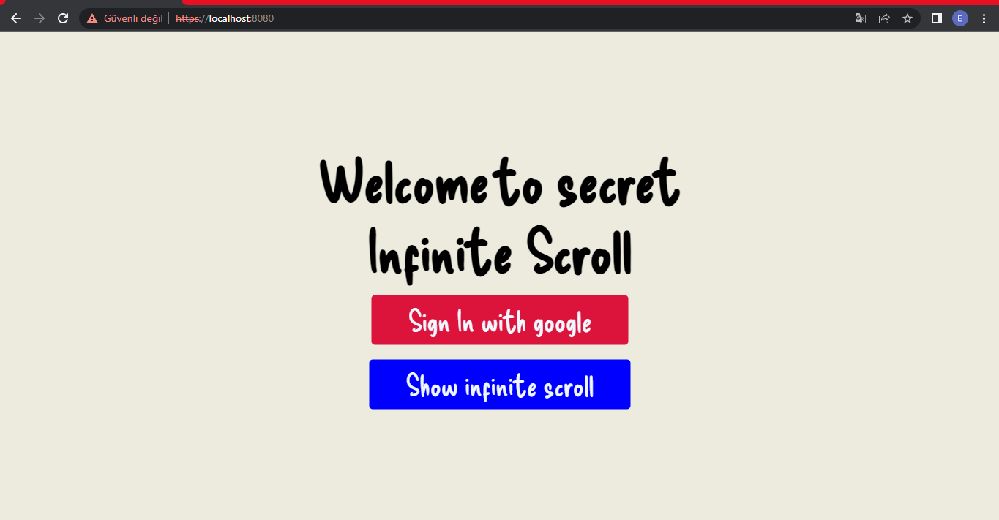
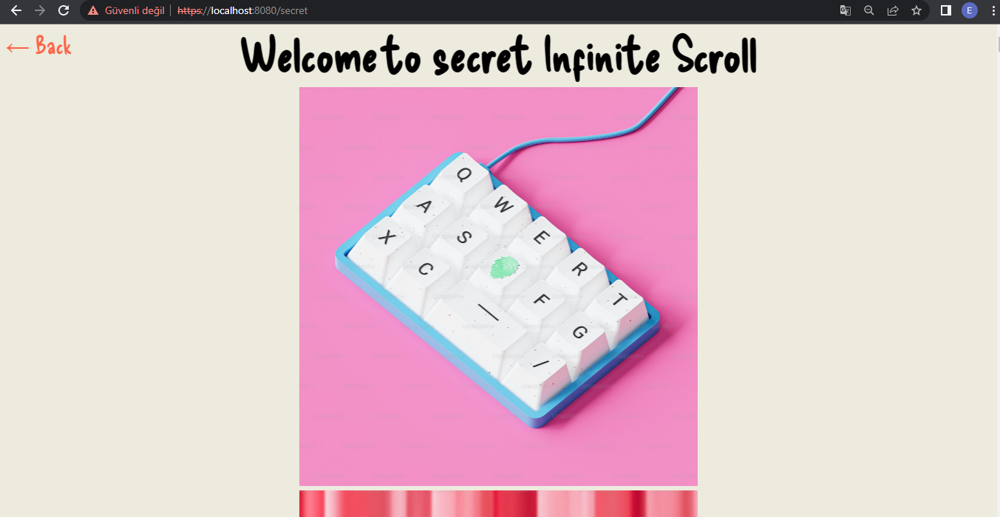

# [Express Infinite Scroll App with Google Sign-In](https://github.com/greatAlhazen/express-google-sign-in)

|           Main           |        Scroll page        |
| :----------------------: | :-----------------------: |
|  |  |

Express Infinite scroll app with google authentication and pug template engine

## Installation

- Clone the repo:

```
git@github.com:greatAlhazen/express-google-sign-in.git
```

- Get into main directory and execute these two commands

```
npm install
```

```
openssl req -x509 -newkey rsa:<key_size:number(example:4096)> -nodes -keyout key.pem -out cert.pem -days <validity_date:number(example:365)>
```

- In the main directory create .env file and specify these

```
PORT: <YOUR_PORT>
CLIENT_ID: <YOUR_GOOGLE_OAUTH_CLIENT_ID>
CLIENT_SECRET: <YOUR_GOOGLE_OAUTH_CLIENT_SECRET>
COOKIE_KEY_1: <YOUR_SECRET_VALUE>
COOKIE_KEY_2: <YOUR_SECRET_VALUE-2>
API_KEY: <YOUR_UNSPLASH_API_KEY>
```

- After,get into terminal and execute this command for preview

```
npm start
```

- After those get into browser and specified https://localhost:<YOUR_PORT>

## Dependencies

- [dotenv](https://github.com/motdotla/dotenv) - For specified environment variables in development mode
- [pug](https://pugjs.org/api/getting-started.html) - For UI
- [express](https://expressjs.com/) - For handling http requests
- [cookie-session](https://github.com/expressjs/cookie-session) - For session store
- [passport](https://www.passportjs.org/docs/) - For configuring passport authentication package
- [passport-google-oauth20](https://www.passportjs.org/packages/passport-google-oauth20/) - For handling google authentication

## Copyright

Copyright 2023 [Enes Uraz](https://github.com/greatAlhazen)
